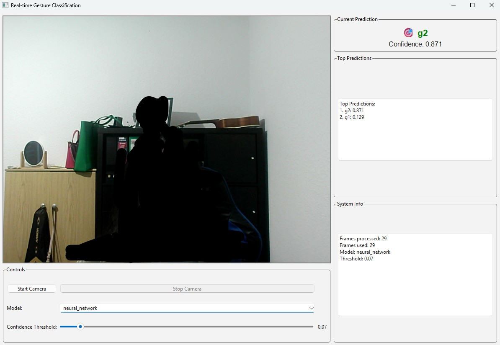

# Gesture Recognition

A desktop gesture recognition and feedback app using Python, PySide6, OpenCV, and MediaPipe Pose. Runs fully on-device.



## Prerequisites
- Windows 10/11
- Python 3.10+

## Quick Start (Windows PowerShell)
```powershell
Set-Location E:\From_C\llm_project\YogaPose
./run_desktop.ps1
```
This script creates a virtual environment, installs dependencies, and launches the app.

## Manual Run
```powershell
python -m venv .venv
. .\.venv\Scripts\Activate.ps1
python -m pip install --upgrade pip
pip install PySide6 opencv-python mediapipe numpy
$env:PYTHONPATH = (Get-Location).Path
python -c "import desktop.app as da; da.main()"
```

## Features
- Live webcam capture
- MediaPipe Pose estimation
- Landmark and skeleton overlay
- Gesture recognition and feedback

## Project Structure
```
GestureRecognition/
  desktop/
    app.py           # PySide6 window, video loop, feedback display
    pose_pipeline.py # MediaPipe Pose wrapper
    overlay.py       # Canvas overlay drawing
    geometry.py      # Angles and normalization utilities
    rules.py         # Gesture rules and cues
  web/               # (Initial web scaffold; not used in desktop mode)
  run_desktop.ps1    # One-command launcher for Windows
```

## Notes
- All inference is on-device; no video frames are uploaded.
- If the webcam does not open, try changing the camera index in `desktop/app.py`.
